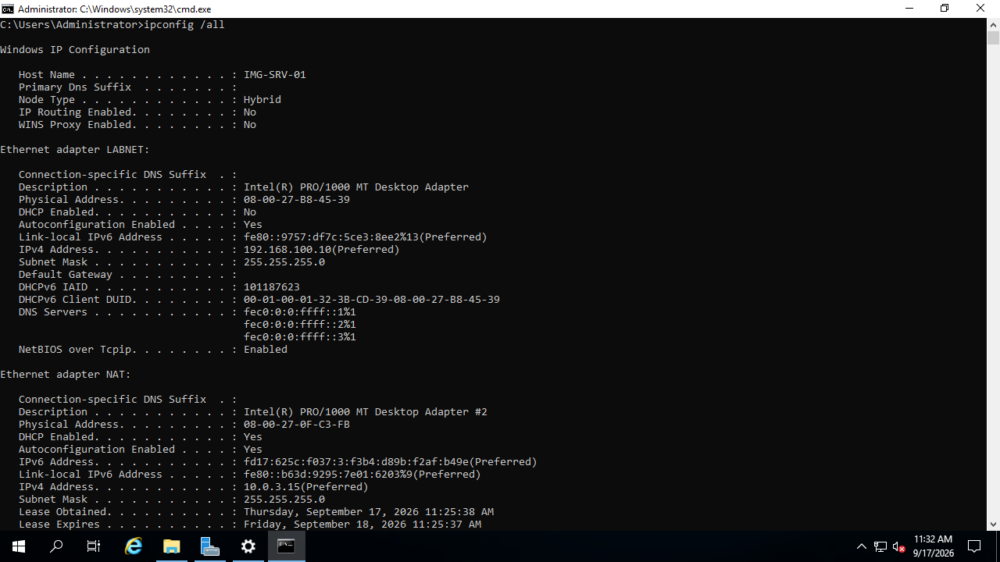
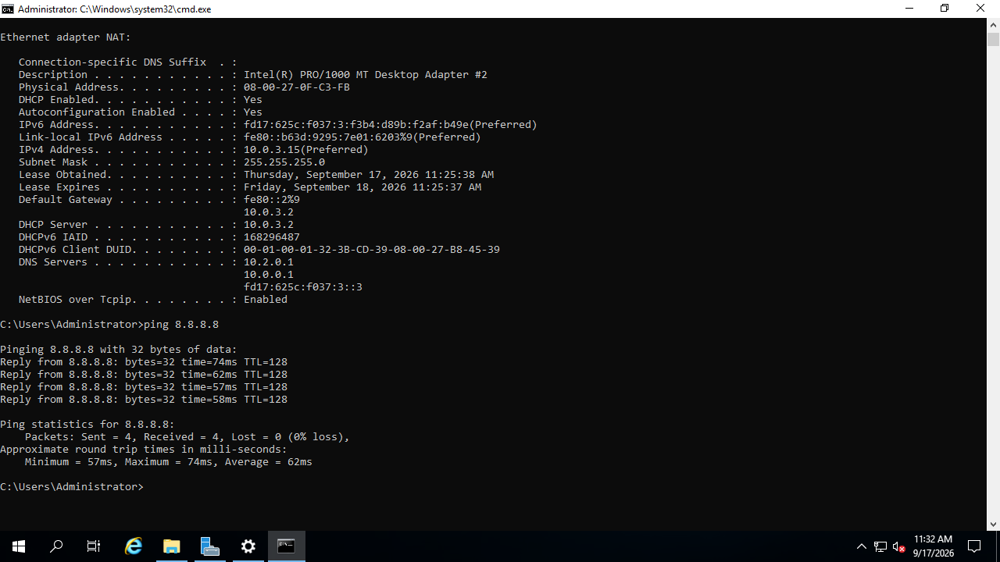
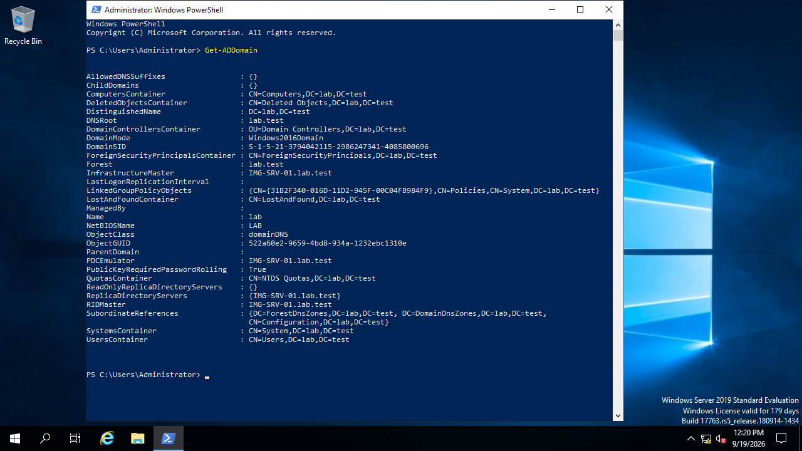
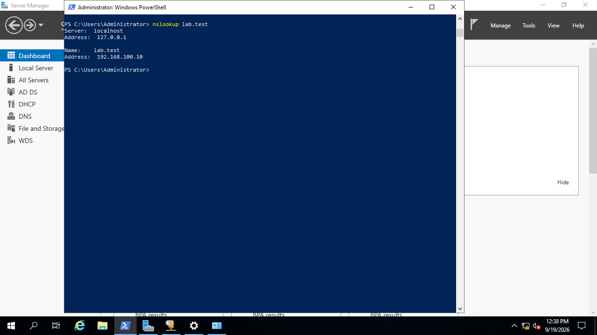
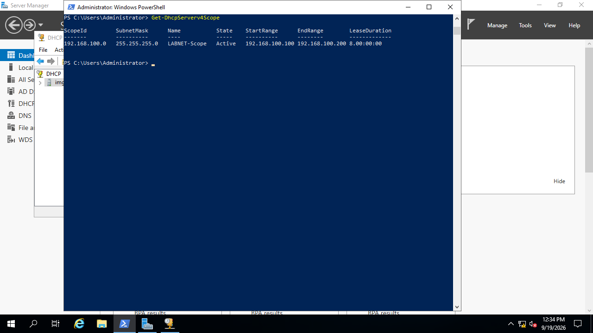
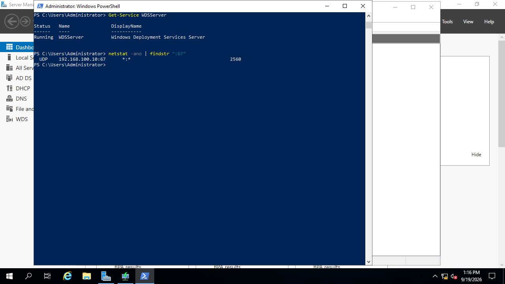

# Objective 1
Build a Windows Server 2019 VM acting as domain controller, DHCP server, and Windows
Deployment Services (WDS) host on an isolated internal network.

## What was Configured
Created a Windows Server 2019 virtual machine with two network adapters: one connected
to a private gateless internal network (LABNET) reserved for imaging traffic, and one
NAT adapter for reaching the internet. See [Network Verification](#1-network-verification) for screenshot confirmation.

Once the server was renamed to IMG-SRV-01, server manager was used to install Active
Directory Domain Services (AD DS), Dynamic Host Configuration Protocol (DHCP), Domain
Name System (DNS), and Windows Deployment Services (WDS). Once installation completed,
the server was promoted to Domain Controller (DC), allowing DHCP to be authorized.
Once DHCP was authorized, WDS could be configured to avoid conflict with DHCP 
(port 67) permitting simultaneous function. The server is prepared for a client connection.
See [Configuration Verification](#2-configuration-verification) for screenshot confirmation.

**Explanation:**\
AD DS promotes the server to a DC, giving it authority over the accounts and the
domain. DNS is required for a DC to resolve domain names to IP addresses- clients 
would be unable to discover "lab.test" without it. DHCP automatically configures 
clients with IP addresses and other network settings using DNS to avoid errors and 
unnecessary time consumption through manual configuration. WDS is critical for 
deploying Windows OS's over the network, replacing manual installation through 
hardware such as CD, DVD, or USB. 

### 1. Network Verification

> *The LABNET adapter shows static IP with no gateway.*

> *The NAT adapter shows assignment of a default gateway and DHCP enabled.
Results of `ping 8.8.8.8` show 0 lost packets, confirming outbound internet
connectivity via NAT's gateway.*

### 2. Configuration Verification

> *The AD DS shows `lab.test` as the forest and DNSRoot.*

> *Using `nslookup` found the server (127.0.0.1 localhost) and its static IPv4 address
assigned for LABNET (192.168.100.10) only. NAT was configured not to register its
connections in DNS to prevent unwanted client gateway access; IPv6 was disabled on
LABNET and NAT to reduce noise.*

> *Configured DHCP scope to include range for 100 connections (192.168.100.100-200) with
a lease of 8 days. Status is active. No default gateway option was set on the scope
to ensure isolation (no route outside lab segment).*

> *The WDS Server was configured to prevent conflicts with DHCP, evidenced by `netstat`-
only DHCP is listening on port :67. WDSServer is running.*
