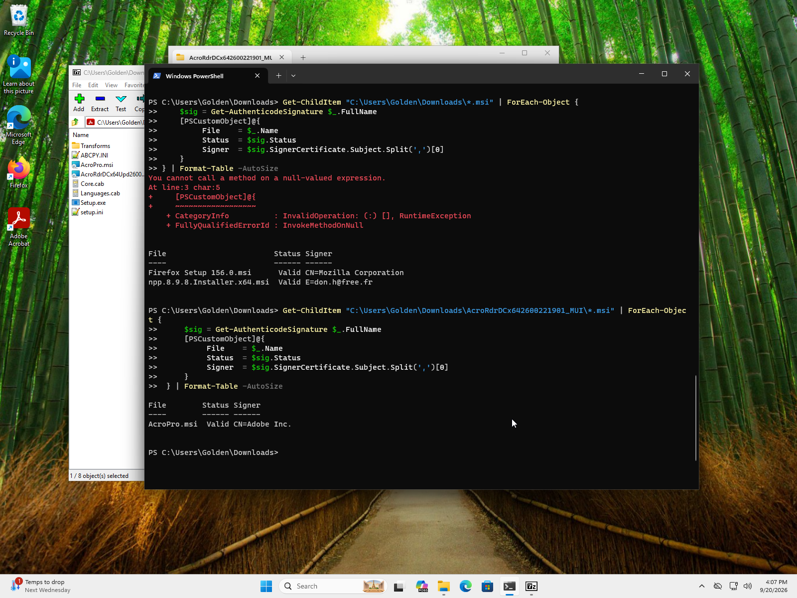
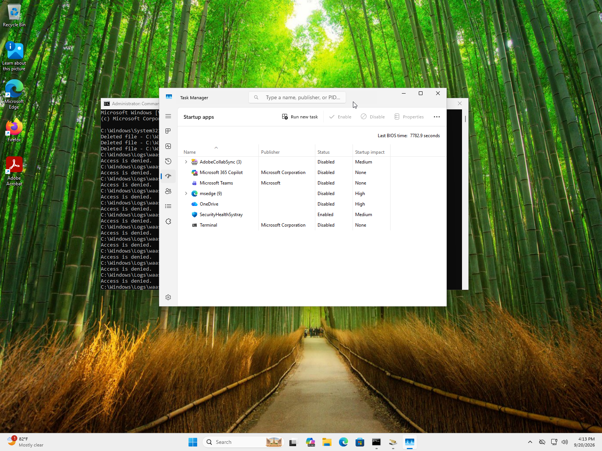
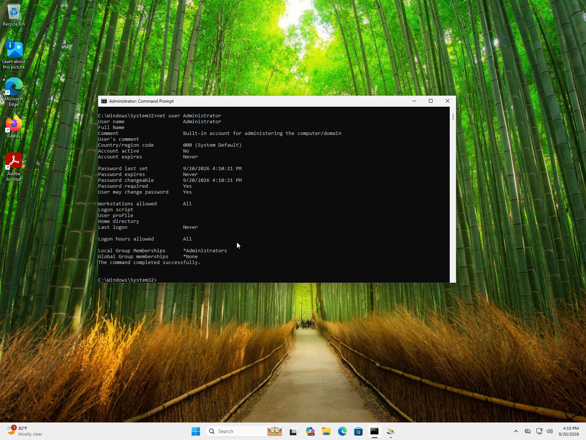
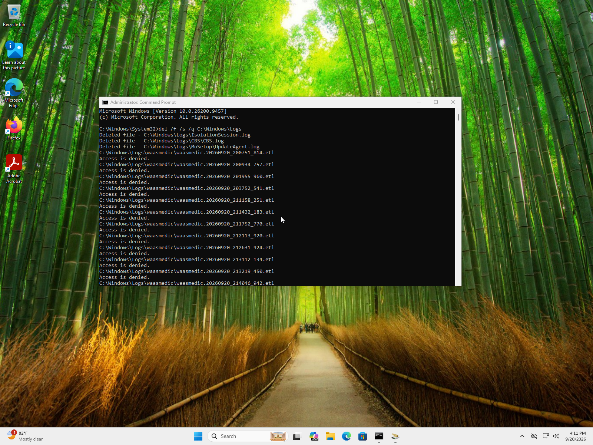
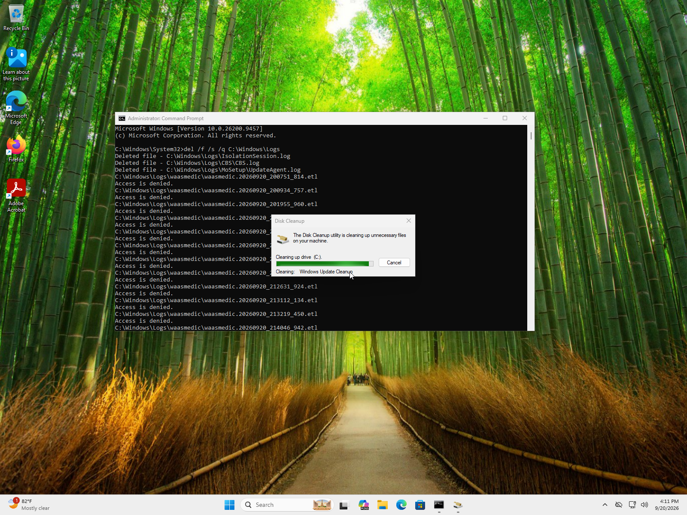
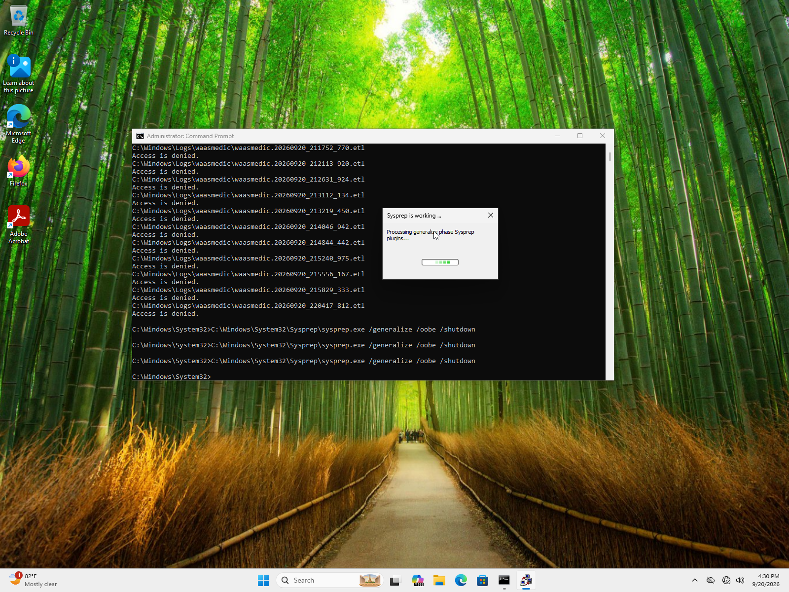
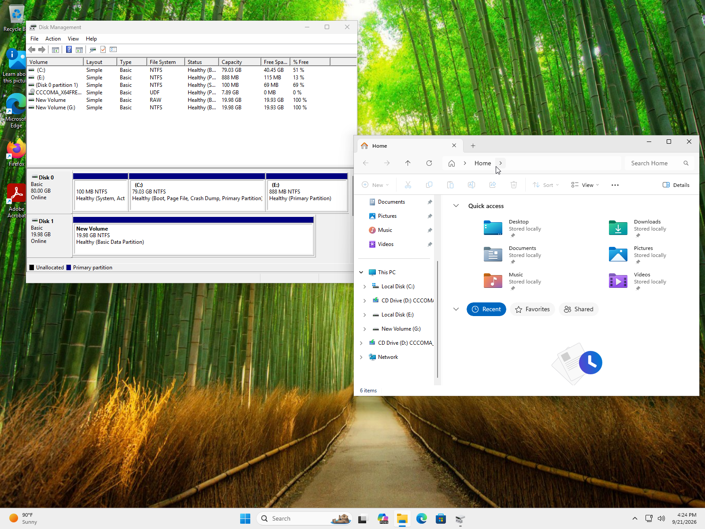
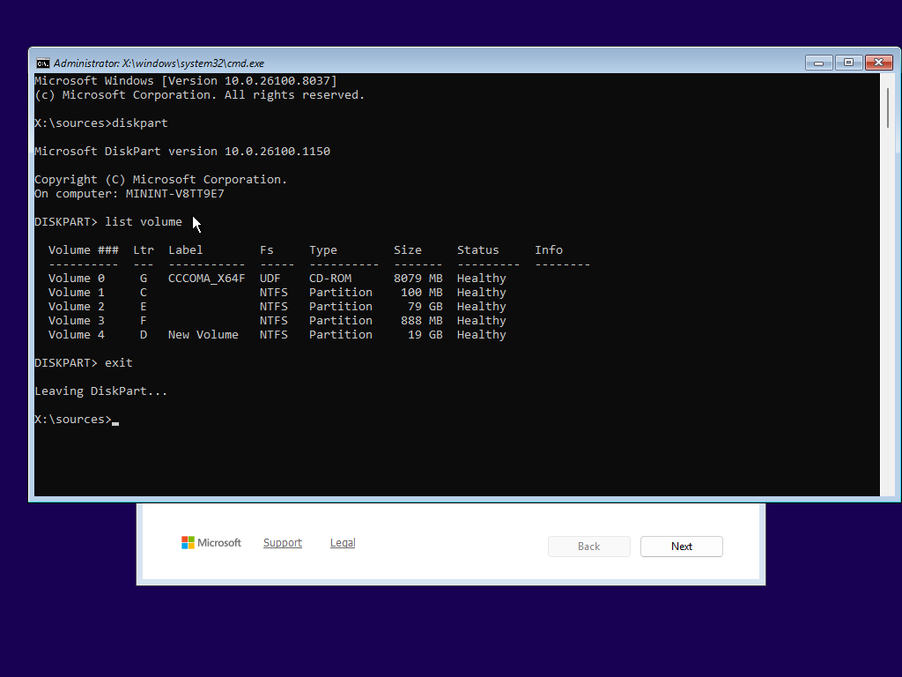
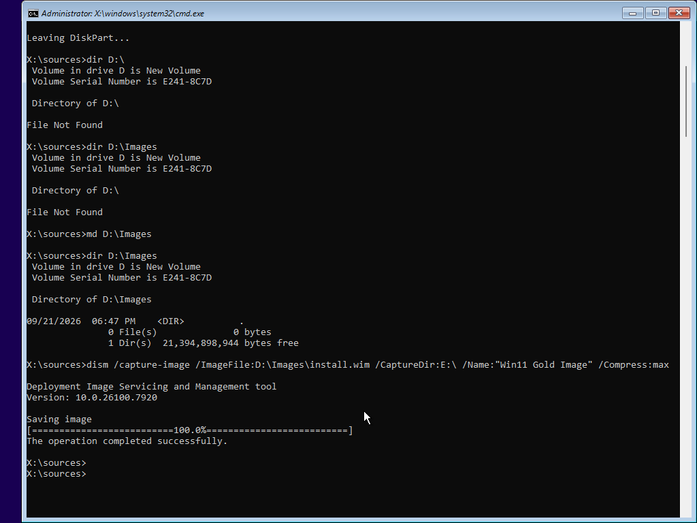

# Objective 2
Configure a Windows 11 reference VM as a corporate workstation baseline, generalize 
it with Sysprep, and capture it to a WIM file.

## What was Configured
A clean installation of Windows 11 Pro was performed on a new VM and several preparations
were made to transition it to a gold image. A selection of applications were installed
and their .msi signatures verified, default settings for applications and the system
were applied, the default Administrator account was ensured to be off, and cleanup was
undertaken before attempting Sysprep. See [Applications and Settings](#1-applications-and-settings) for screenshot confirmation.
A per-user installation issue was discovered and corrected, allowing Sysprep to run 
smoothly. See [Cleanup and Preparation](#2-cleanup-and-preparation) for screenshot confirmaton.

Once Sysprep was successfully run, the VM was booted from the installation ISO into 
WinPE- the command-line pre-installation environment. The frozen disk was captured 
without modification in WinPE as a Windows Image (WIM) on a separate partition and
is now ready for WDS deployment. See [WinPE Gold Image](#3-winpe-gold-image) for screenshot confirmation.

**Explanation:**\
A gold image is an image of an operating system, such as Windows 11, that has all of
the required base configurations for mass deployment and all of its individual
identifiers erased so it can be repeatedly distributed. Lacking a repository of 
whitelisted applications in a cloud, I downloaded .msi installation packages for 
commonly deployed apps- Notepad++, 7-Zip, Adobe, and Firefox; this ensures every
deployment of the gold image has these applications pre-installed. I verified each
application's signatures using `Get-AuthenticodeSignature` to assess the validity of
the signature and evaluate who the signer is for security purposes. I altered some
settings such as clearing all unnecessary applications attempting to run at startup
to avoid unnecessary lag in deployments. After all had been configured, I ensured
that the default Administrator account was disabled as it would leave a simple
vulnerability open for attackers attempting to escalate privileges in the systems. 
I then cleaned everything off of the computer so no installation packages, logs, 
Recycle Bin contents, or Windows Update cache files remained on the machine to optimize
performance and reduce threat vectors. Sysprep was run to remove PC-specific information
including its security identifier (SID) so it could be deployed to other machines
without conflict; without using Sysprep, they would effectively be duplicates of one
machine indistinguishable from each other on the network, and unable to hold unique 
domain accounts or machine trust relationships. Booting using the installation media 
prevented the gold image from being modified by startup while I created its WIM file
in the command prompt using WinPE. 

### 1. Applications and Settings

> *To reduce noise from individually verifying every MSI installer, I created a table
that would find and list only the file name, its verification status through
`Get-AuthenticodeSignature`, and the first value of the SignerCertificate Subject 
typically Common Name (CN). All results were verified signatures from expected companies
with the exception of 7-Zip which does not have a digital signature, hence the null 
error. In an enterprise environment, only whitelisted apps would be installed, but 
for the purposes of the lab, 7-zip was installed after verifying the trusted official
website.*

> *All unnecessary startup tasks were disabled to prevent poor startup performance.
Default settings in downloaded applications were configured not to appear on startup
as well.*

> *Called `net user Administrator` to check the status of the default Administrator
account, ensuring `Account active	No`. This shrinks the attack surface by eliminating
a simple privilege escalation threat vector.*

### 2. Cleanup and Preparation

> *Forcefully deleted all possible logs from `C:\Windows\Logs` and its subdirectories
so deployed machines would not inherit the reference machine's log history.*

> *Ran Disk Cleanup to clear temporary files, thumbnails, and Windows Update cache 
files to reduce disk usage.*

> *Initially, Sysprep refused to complete and directed me to the `setupact.log`; 
I discovered that I had installed the applications with per-user .exe installers, which 
reference user profiles that cannot be generalized. I reinstalled all applications 
using their MSI equivalents, and Sysprep ran smoothly, hence the multiple calls to 
Sysprep. Parameters `/generalize` and `/oobe` were used to strip the image of its 
unique identifiers and initiate the Windows 11 Pro image in Out of Box Experience.
The `/shutdown` parameter was used to prevent reboot failures. 
Setup automation via answer files is a planned refinement for the deployment phase.*

### 3. WinPE Gold Image

> *In my first attempt to capture the frozen Windows 11 disk to a WIM file, I had not
yet formatted the disk I was attempting to save the WIM file to. Upon realizing this,
I reverted the machine to an earlier state using snapshots and formatted a new virtual
hard disk, assigning it the letter G:\. I then proceeded once more with Sysprep, 
repeating cleanup and preparation procedures beforehand.*

> *I learned that in virtual machines, snapshots prevent proper imaging from occurring.
Before I could take a golden image of the machine, I needed to compress all of the
snapshots. After this was completed, I ran `diskpart` and `list volume` to find what
drive letters had been assigned to my virtual hard drive and the operating system
(D:\ and E:\ respectively) and ran `dism /Capture-Image` using the appropriate drive
letters. The gold image has been saved as `install.wim`.*