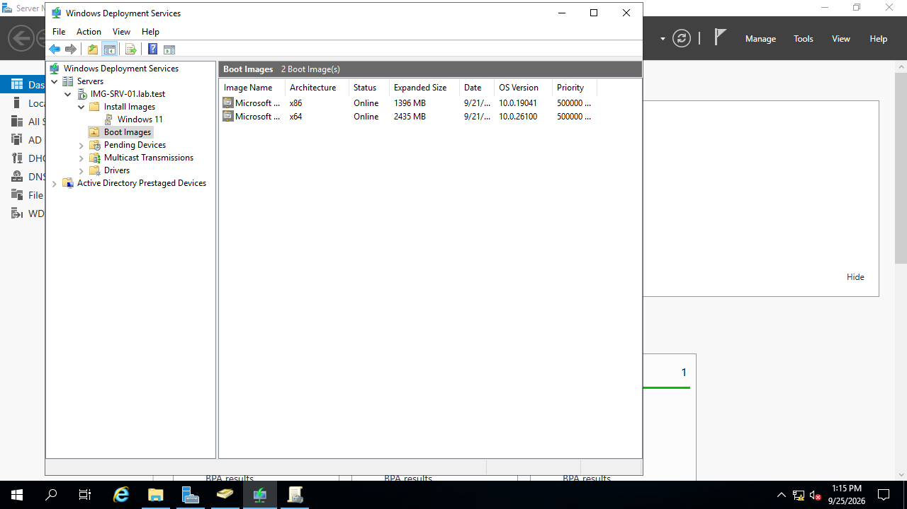
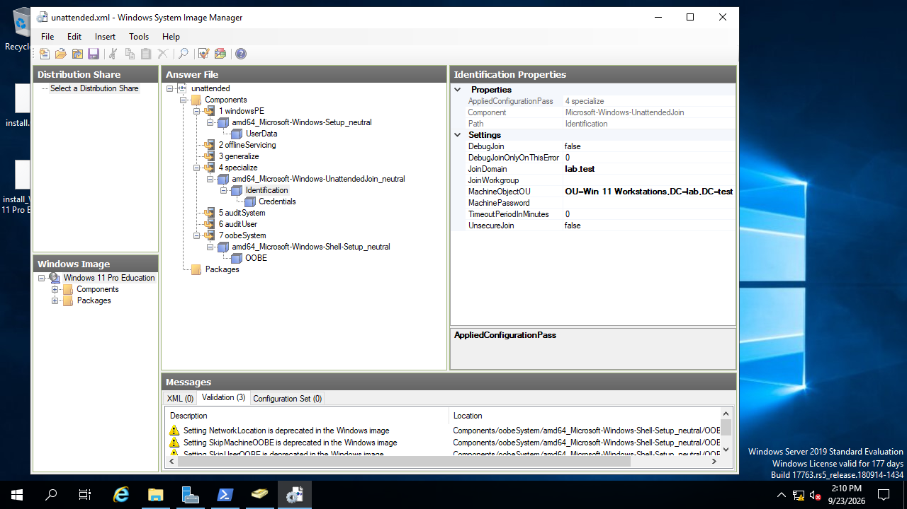
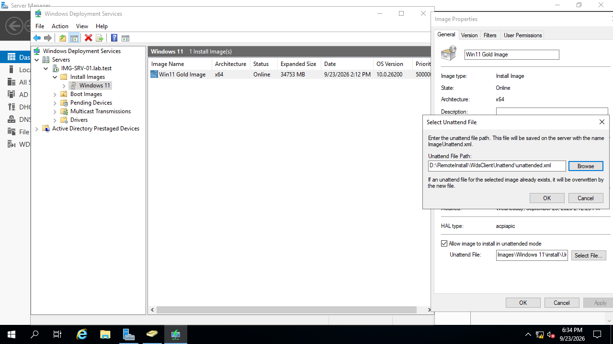
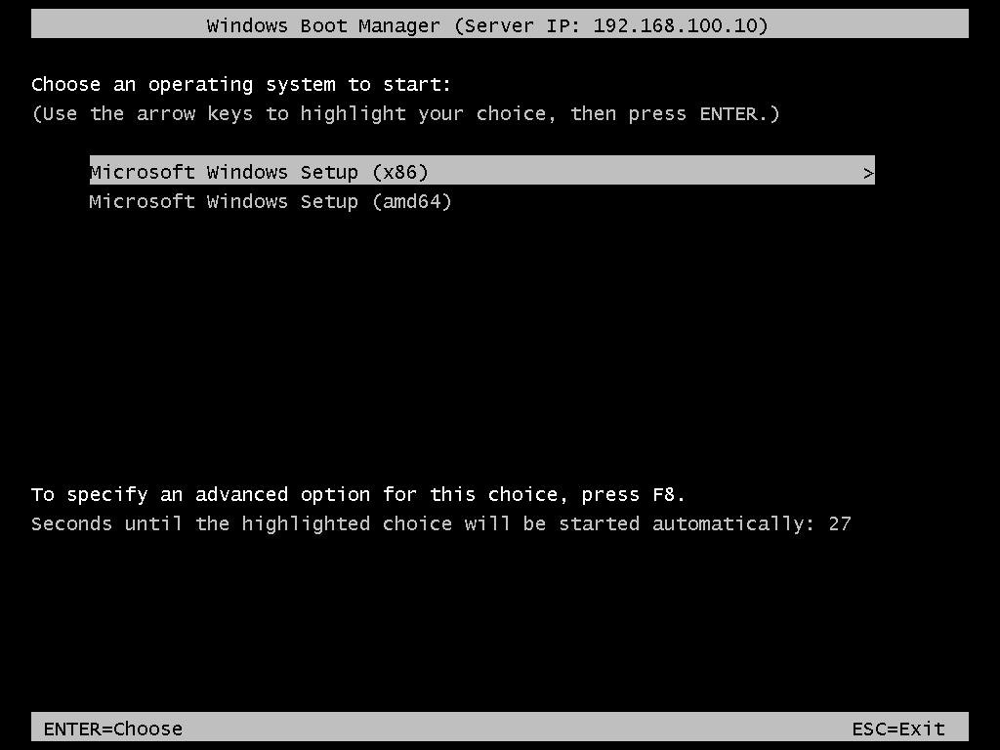
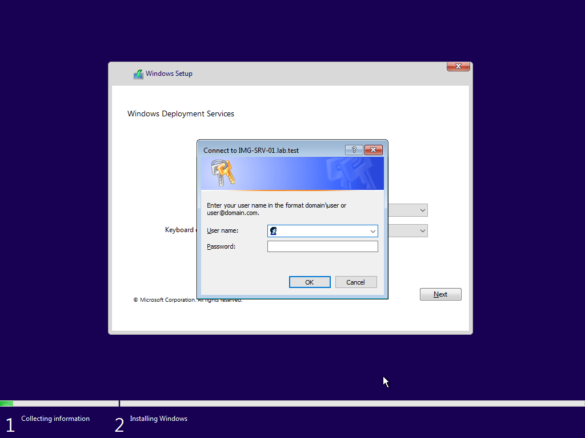
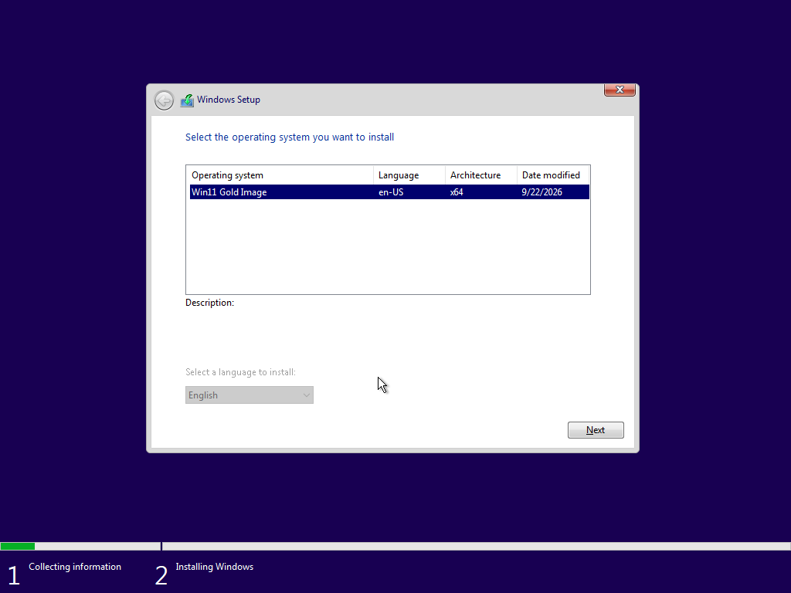
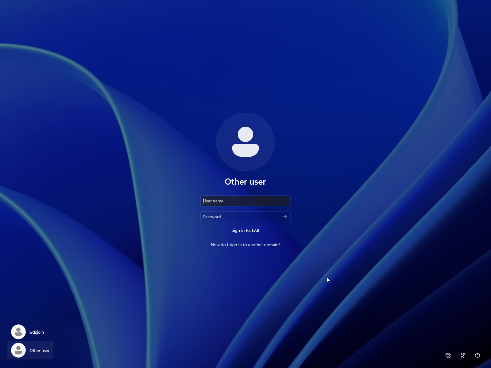
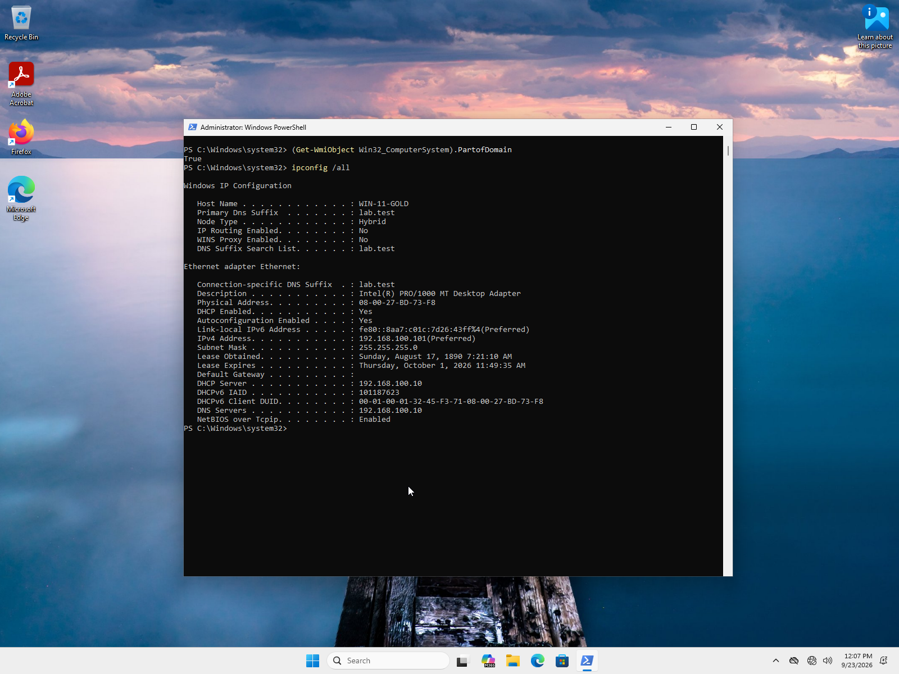
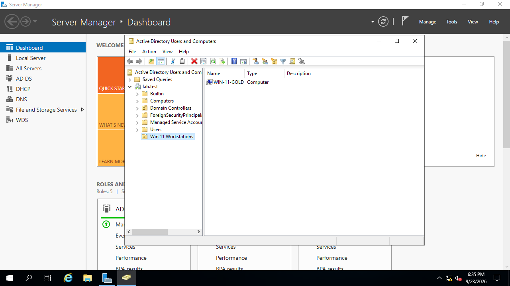

# Objective 3
Import the captured image into WDS and deploy it to a fresh target VM via PXE network
boot—no installation media required.

## What was Configured
The hard drive containing the captured gold image was attached to IMG-SRV-01 and the
image was attached to the lab.test server's Install Images using Windows Deployment 
Services (WDS). An x86 boot.wim extracted from a Windows 10 deployment was attached 
to lab.test's Boot Images; x86 was chosen instead of x64 due to a VirtualBox EFI 
limitation. In an effort to deploy the machine realistically for an enterprise 
environment, an unattend file was configured for automated deployment. See [WDS
and Unattend File](#1-wds-and-unattend-file) for screenshot confirmation.

Windows System Image Manager (WSIM) was installed on the server and an answer file
created with a catalog from the original Windows 11 Pro Education install.wim file
from the ISO. The unattend was created to bypass Out of Box Experience (OOBE) and
automatically join the domain using a domain-joiner account "wdsjoin". After all
configurations were completed, Preboot Execution Environment (PXE) through WDS 
was used to successfully deploy the boot.wim and install.wim, requiring Administrator
credentials to complete. See [PXE and WinPE](#2-pxe-and-winpe) for screenshot confirmation. Domain join was successfully verified through logon credentials
and creation of the WIN-11-GOLD computer object in the Win 11 Workstations Organizational
Unit (OU). Several deployments of the Windows 11 gold image may now be executed. See
[Client Deployment](#3-client-deployment) for screenshot confirmation.

**Explanation:**\
For the gold image to be used, it must be uploaded or attached to the server for
centralized deployment tools such as WDS to interact with it. WDS allows install and
boot images to be attached to the server and configured before they are deployed to
client machines. For as much of a hands-off installation as possible, answer files
(unattend.xml) may be attached to install images. They automate configuration of the
machine OS through a series of seven "passes", each running at a different point during
installation. For example, OOBE sits at pass 7, the final pass before operation. 
An answer file may automatically accept the EULA agreement (pass 1: windowsPE), automatically join a 
computer to the domain (pass 4: specialize), or hide the local account creation screen (pass 7: oobeSystem). Answer files may also
be attached to the server in WDS; when attached to the server, they apply to all
install images in WDS under that server. 
The machine contacts the server via PXE, downloads the boot image, and boots into WinPE, which is the 
pre-installation environment that allows remote installation from the server. 
Without it, the machine enters aninfinite boot loop since it has no way to install 
operating systems natively. The machine contacts the server to grab the boot image from WDS,
and after the boot image is run, WinPE requests login credentials for the server to validate that the user is part of the domain. 
This is because the machine is untrusted by the server; not just any machine ought to be able to join the server.  
Once credentials are confirmed, WinPE allows selection of the install image from WDS's list and h
properly in pass 7, it will pass on values for any OOBE prompts at this point to the OS,
in my case, eliminating OOBE altogether. 
At the login screen, domain join was visually confirmed through "Sign in to LAB" beneath the username and password prompt. Once 
inside, the four apps selected in Objective 2 were verified as installed and available
through Uninstall in settings, confirming their survival through Sysprep. An elevated
Powershell was used to run `(Get-WmiObject Win32_ComputerSystem).PartofDomain`; this
states whether the computer is part of any domain with either `True` or `False`. To
confirm connection to only LABNET, the internal network hosted by IMG-SRV-01, 
`ipconfig /all` was run. Once `PartofDomain` returned `True` and connection to 
`lab.test` through the DHCP server at `192.168.100.101` was confirmed,
the machine was considered fully deployed and operational.

### 1. WDS and Unattend File

> *Initially, I attempted to PXE the client without a boot image and got stuck in an
infinite boot loop. Due to a VirtualBox quirk with EFI, I had to download and use
a Windows 10 ISO and extract the boot.wim for x86. On PXE, I am prompted for either
x86 or x64, as either will function with a Windows 11 installation.*

> *This is the GUI for WSIM with my answer file (named unattended.xml) loaded.I have
components selected for passes 1, 4, and 7: windowsPE, specialize, and oobeSystem, 
respectively. I encountered several challenges here, including mixed usage of wow64
and amd64 components, learning that credentials are stored in plain text on client 
machines, and in understanding the distinguished format requirement for the 
MachineObjectOU. For several attempts, I had believed that my unattend was completely
corrected, only to learn that the brief name for my OU, "Win 11 Workstations", was 
inappropriate for the XML. Its distinguished name, "OU=Win 11 Workstations, DC=lab, 
DC=test" was required. As with any language, formatting is extremely important to 
the execution success.*

> *I learned after several attempts with a well-combed unattend.xml that Windows silently
stores its own copy when it is attached to the install.wim. I realized after an 
attempt in which an account I had confirmed was scrubbed from my working document
appeared as available upon login. After overwriting Windows's unattend file, all
functioned as intended. Lesson learned: either directly edit the Windows unattend
after its creation or make a habit of reappending the unattend.xml every save and 
verification edit.*

### 2. PXE and WinPE

> *The proper server was contacted, confirmed by the server IP '192.168.100.10` across
the upper banner. Both x86 and amd64 boot images were available; due to VirtualBox
EFI limitations, I selected the x86 boot image. Among the options for the server in 
WDS was to Always continue the PXE boot, which I selected to avoid the short timing
available for the user to press F12 for PXE boot. The only catch it introduced was
that, upon installation of the gold image and reset, the machine would boot back
in to PXE and needed to be shut down and reconfigured to boot from hard drive.*

> *WDS requires credentials upon login for the domain. When I first completed this
setup, I simply used the Administrator credentials for IMG-SRV-01 as I did not have
any other user accounts configured. I have since learned that by default, *any* user
can authenticate at this point, as long as they are a domain user. This will be 
updated as part of Objective 4 to lower the risk of the threat vector; not simply
any employee ought to be permitted to PXE boot a new machine on to the domain ie
least privilege must be enforced.*

> *The gold image appeared in the list of images available to install, further
confirming the proper configuration of WDS. All install images available on the server
appear in this list and may be selected.*

### 3. Client Deployment

> *On the login screen, I could finally determine that the computer had joined the
domain due to the "Sign in to: LAB" text appearing beneath the password field. The 
wdsjoin account appearing was another unattend.xml bug that needed repair after many
attempts to fix the specialize pass, which is now corrected. The wdsjoin account was
created for the sole purpose of creating Computer objects in my Win 11 Workstation
OU. The greatest security concern for wdsjoin is its password being stored in plain
text in the unattend.xml.*

> *I ran two commands for confirmation of domain connection via unattended script:
`(Get-WmiObject Win32_ComputerSystem).PartofDomain` and `ipconfig /all`. `PartofDomain`
returned `True`, confirming connection to a domain, and `ipconfig/ all` returned only
connection to lab.test on a DHCP assigned IP `192.168.100.101`. Combined with the
login credentials, this confirmed thoroughly that the workstation had successfully
connected to the server domain.*

> *For further assurance, Active Directory Users and Computers (ADUC) was consulted and 
confirmed to contain the new computer, WIN-11-GOLD in the proper OU, Win 11 Workstations.
I originally renamed the computer in the answer file, but this is not sustainable;
future renamings will be performed manually from the ADUC. Lack of sustainability comes
from all computers set up with that answer file having exactly the same name which would
give rise to an abundance of errors.*